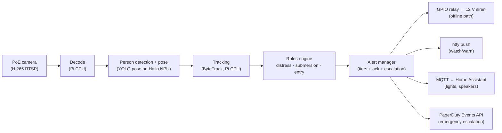

# PoolGuard Architecture

**Status:** Living document · v0.1 · 2026-07-24
**Owner:** Sean Enright
**Companions:** [PRD.md](../PRD.md) (requirements), [BOM.md](../BOM.md) (hardware),
[edge-inference.md](./edge-inference.md) (NPU details), PLAN.md (phase progress)

This document explains *how* PoolGuard is built and *why* each significant
decision was made. Requirements and success metrics live in the PRD; this
document assumes them and records the architecture that satisfies them.
Decisions are recorded as ADRs ([§3](#3-decision-records)) — new decisions get a new ADR; reversed
decisions get a superseding ADR, never an edit.

---

## 1. System context

PoolGuard is a single-household safety monitor: one outdoor PoE camera watches
a residential pool, one Raspberry Pi 5 with a Hailo-8 NPU runs the entire
detection and alerting stack on-premises. There is no cloud component and no
vendor service in the detection path.

The design is dominated by three constraints from the PRD:

1. **A missed detection is worse than a false alarm** ([PRD §4](../PRD.md#4-success-criteria)) — the system is
   tuned sensitivity-first, and alert fatigue is managed structurally (tiers,
   ack flow) rather than by raising thresholds.
2. **The siren must work with the internet down** ([PRD §2](../PRD.md#2-goal)) — the highest-severity
   output path is a hardwired GPIO relay, not a network call.
3. **≤ ~$500 hardware, installable by one person** ([PRD §4](../PRD.md#4-success-criteria), [§6](../PRD.md#6-hardware)) — which rules out
   commercial multi-camera rigs and drives the single above-water camera
   choice for v1.

## 2. System overview

### 2.1 Pipeline stages

| Stage | Runs on | Responsibility |
|---|---|---|
| Ingest/decode | Pi CPU | Pull RTSP, decode H.265 (HW-assisted; Pi 5 has no HW H.264 decode) |
| Detection + pose | Hailo NPU | Person boxes + 17 COCO keypoints per frame, compiled `.hef` model |
| Tracking | Pi CPU | ByteTrack persistent IDs so rules reason about individuals over time |
| Rules engine | Pi CPU | Interpretable distress / submersion / entry logic over track histories |
| Alert manager | Pi CPU | Tier selection (watch/warn/emergency), ack flow, escalation timers, mode awareness (armed/swim/maintenance) |

Stages communicate exclusively via **frozen (immutable) Pydantic event models**
(`src/poolguard/events.py`). Configuration is validated at startup via
pydantic-settings; an invalid config is a refusal to start, not a runtime
surprise — appropriate for a safety monitor that otherwise fails silently.

### 2.2 Trust and failure model

The detection path is designed so that severity and infrastructure dependency
are inversely related:

- **Emergency siren:** camera → Pi → GPIO relay. Survives loss of internet,
  Wi-Fi, and every third-party service. Depends only on mains power (12 V
  siren supply) and the LAN PoE run.
- **Push/HA tiers:** depend on LAN and (for ntfy) internet; their loss is
  detected and reported, not fatal.
- **Escalation tier (PagerDuty):** depends on internet; it is the *last* rung,
  reached only when a human hasn't acknowledged.
- **Self-monitoring:** watchdog + heartbeat. Camera offline, FPS below floor,
  or a blocked lens is itself an alert (degraded-mode), because a silently
  dead safety system is worse than none — it creates false confidence.

---

## 3. Decision records

Statuses: **Accepted** (in force) · **Provisional** (accepted with a named
condition that could reverse it) · **Deferred** (explicitly not decided yet).

### ADR-001: Edge compute is Raspberry Pi 5 + Hailo-8 (26 TOPS AI HAT+)

**Status:** Accepted · 2026-07-24 (Jetson kept as escape hatch)

**Context.** The pipeline needs sustained pose estimation (~15+ FPS at 1080p)
plus CPU headroom for decode, tracking, and rules, within the ~$500 budget and
a passively-manageable power/heat envelope for a garage install.

**Decision.** Raspberry Pi 5 (8 GB) with the 26 TOPS AI HAT+ (Hailo-8).

**Alternatives considered.**

- *NVIDIA Jetson Orin Nano Super ($249):* ~4× NPU headroom, full CUDA
  ecosystem, runs PyTorch natively. Rejected for v1 on cost (+$100 over the
  Pi path), power draw, and a weaker hobbyist camera/NVR ecosystem. **Kept as
  the named escape hatch:** the camera, siren, and alerting layers are
  compute-agnostic, so swapping compute strands nothing but the inference
  stage.
- *13 TOPS Hailo-8L variant ($70):* rejected for $40; pose models are heavier
  than plain detection, and the v2 underwater camera adds a second stream to
  the same chip.
- *Pi 5 CPU-only / Coral TPU:* cannot sustain pose at the required FPS; Coral
  is effectively end-of-life with poor modern-model support.

**Consequences.**

- Models must be **compiled** (ONNX → Hailo Dataflow Compiler → `.hef`), not
  loaded — fine-tuning later means a recompile step (see edge-inference.md).
- The HAT consumes the Pi 5's only PCIe lane → **no NVMe**; OS and footage
  live on microSD/USB.
- Camera must be configured for **H.265** — Pi 5 dropped HW H.264 decode, and
  software decode steals CPU from tracking.
- Exit criterion P0 validates the bet: if the bench rig can't hold 15 FPS
  pose at 1080p, fall back to detection-only + track heuristics, then Jetson.

**2026-07-29 pricing addendum.** The cost assumptions behind this ADR have
shifted materially since it was written. Memory cost pressure from AI
infrastructure demand pushed DRAM-driven component costs up across the board
in late 2025 into 2026, not specific to any one retailer. As of this date:

- Pi 5 8GB bare board: ~$170-175 across every checked reseller (PiShop,
  Micro Center, CanaKit), versus the $80 MSRP this ADR's budget math assumed.
  This is now roughly double the original board-cost assumption.
- AI HAT+ 26 TOPS: ~$110, close to original estimate, the $40 delta over the
  13 TOPS variant is unchanged.
- Full BOM (Phase 0 + Phase 3) is now ~$630-640 street, versus the ~$460
  MSRP-based figure this ADR implicitly assumed when weighing the 26 TOPS
  vs 13 TOPS tradeoff at "+$40 for headroom."

**Reopened question:** the 26 TOPS vs 13 TOPS tradeoff was framed as a small
delta justified by pose-model headroom and v2's second camera stream. With
total system cost up ~40% and the Pi board itself now the single largest
line item, that $40 delta is proportionally smaller than it was, which
weakens the case for trimming here specifically. But since v2 (ADR-008) is
still deferred and unscheduled, the "headroom for a second stream"
justification is speculative cost, not committed cost. Worth revisiting
once P0 benchmarks are in: if 13 TOPS clears the 15 FPS bar with margin,
the $40 saved is better spent absorbing the Pi board's price increase than
insuring against a v2 that may not happen for a year or more.

No action taken yet, this is a note for the P5/ADR-008 revisit or for
whoever reviews the BOM next, not a superseding decision.

### ADR-002: All inference on-device; no cloud in the detection path

**Status:** Accepted · 2026-07-24

**Context.** Cloud vision APIs would simplify the model problem, but the
system watches a family pool (swimsuits, children, guests) 24/7, and the siren
is a life-safety output.

**Decision.** Every frame is processed and discarded on the Pi. No frames,
clips, or events leave the LAN except outbound alerts. Local clip storage
auto-expires.

**Alternatives considered.**

- *Cloud inference (Rekognition-class APIs):* rejected on all three grounds
  independently — privacy (continuous footage of a family pool to a third
  party), latency (the <5 s detection-to-siren budget can't absorb upload +
  API variance), and availability (an ISP outage must not disable drowning
  detection).
- *Hybrid (local detection, cloud verification):* rejected; adds a
  distributed-system failure mode to exactly the path that must be simplest,
  and the sensitivity-first stance means we'd never let a cloud "no" veto a
  local "yes" anyway.

**Consequences.** Model quality is capped by what the Hailo can run — accepted
and mitigated by the rules-engine design (ADR-004). Privacy posture is simple
to state and audit. The open-source story is stronger (no account, no keys to
run detection).

### ADR-003: v1 is a single elevated above-water camera; underwater deferred to v2

**Status:** Accepted · 2026-07-24

**Context.** The three detection targets have different viewpoint needs:
surface distress and deck/entry are best seen from above; a body at the bottom
is best seen from below. Commercial systems at the reliability ceiling
(Poseidon) use both views — at $100k+ installs.

**Decision.** v1 ships one PoE turret camera mounted high (eave / 10 ft pole),
steep angle down the pool's long axis, with a circular polarizer. Bottom-of-
pool detection in v1 is **inferential**: track-loss logic ("person went under
and never resurfaced within N seconds") rather than direct observation. v2
adds a dedicated underwater view for bottom confirmation.

**Alternatives considered.**

- *Underwater-only (Coral Manta/MYLO form factor):* rejected as sole camera —
  no deck view means no unsupervised-entry detection (the scenario with the
  longest time-to-intervene window), and water-level views of surface
  distress are poor.
- *Both cameras in v1:* rejected on budget (+$150–300), install complexity
  (wall penetration or periscope rig), and sequencing — the above-water rig
  alone covers the two highest-value scenarios, and v2's underwater trade
  study (over-the-edge housing vs floating buoy, [PRD §7](../PRD.md#7-above-water-vs-underwater-camera-analysis)) benefits from real
  footage first.

**Consequences.** v1's known blind spot is direct bottom observation in
glare/ripple/night-IR conditions (IR does not penetrate water usefully).
Track-loss submersion logic covers the "went under, never came up" case
regardless of bottom visibility — the residual gap is a person entering
undetected *and* resting on the bottom, which armed-mode entry detection
exists to prevent. This gap is named in the PRD risk table and is the primary
motivation for v2, not an accepted permanent limitation.

### ADR-004: Generic pose model + interpretable rules engine — not an end-to-end drowning classifier

**Status:** Accepted · 2026-07-24

**Context.** Academic work (MS-YOLO, YOLO11-LiB) reports 90%+ mAP on
drowning-class detection, so training a "drowning detector" is tempting. But
those models are trained on indoor commercial pools; our deployment is one
elevated outdoor residential viewpoint with glare, rain, night IR, and
toddler-sized subjects — exactly where black-box transfer fails, and fails
silently.

**Decision.** The neural network stays a **generic person + pose estimator**
(commodity, swappable, well-supported on Hailo). All drowning-specific
semantics live in an interpretable rules engine over pose tracks:

- *Distress:* vertical posture + high-frequency arm motion + negligible
  horizontal travel, sustained > N seconds (the "instinctive drowning
  response" signature).
- *Submersion:* track lost below the surface, no resurfacing within N
  seconds.
- *Entry:* person in water while the system is armed.

**Alternatives considered.**

- *Fine-tuned end-to-end drowning classifier:* rejected for v1. Not
  falsifiable in the field (a missed detection yields no explanation), not
  tunable without retraining + recompiling to `.hef`, and dependent on
  transfer from mismatched datasets. Fine-tuning re-enters later (P4) — but
  to improve *pose robustness* on our own footage, not to replace the rules.
- *Motion/heuristic-only (no NN):* rejected; can't distinguish a person from
  a float, can't do posture, and entry detection needs person class.

**Consequences.** Every alert is explainable ("track 3: vertical 9 s, arm
frequency X, travel < Y m") — which makes false-alarm tuning a config change,
not a training run, and makes the staged-scenario test protocol (mannequin,
doll entry) meaningful. Thresholds are config, validated at startup. The cost:
rule design is on us, and rules can encode our blind spots — mitigated by the
P1 labeled clip library and replay harness, which turn rule changes into
regression-testable diffs.

### ADR-005: Custom Python pipeline; Frigate (if used) is a companion NVR only

**Status:** Provisional · 2026-07-24 — revisit at P2 if pipeline scope creeps

**Context.** Frigate is the mature open-source NVR: RTSP handling, recording,
motion gating, Home Assistant integration for free. Extending it was the
obvious build-vs-adopt question ([PRD §11](../PRD.md#11-open-questions)).

**Decision.** The detection pipeline is custom Python 3.12 (uv, src layout,
ruff), because the core value — pose-based rules over persistent tracks — sits
exactly where Frigate's detector/tracker plugin seams are most rigid; Frigate's
object-detection hooks don't cleanly expose per-frame keypoints to downstream
custom logic. Frigate may still run **alongside** as a recorder, feeding the
P1 footage library, without being in the detection path.

**Alternatives considered.**

- *Extend Frigate:* rejected (provisionally) — we'd be maintaining a fork at
  its least-stable extension points, and its pipeline assumes
  box-detection semantics, not pose tracks.
- *DeepStream / GStreamer graph app:* Hailo's own examples are GStreamer, and
  the P0 bench rig starts from them — but building the *product* as a
  GStreamer graph app trades Python-ecosystem velocity for throughput we
  don't need at one camera.

**Consequences.** We own RTSP reconnect logic, recording, and clip management
that Frigate would have given us free — accepted, and scoped small (one
camera). Isolation of heavy vision deps in a `vision` extra keeps dev machines
light. If P2 reveals we're rebuilding half an NVR, this ADR gets superseded,
not bent.

### ADR-006: Tiered alerting, sensitivity-biased; emergency escalation via PagerDuty Free

**Status:** Provisional · 2026-07-24 — conditional on PagerDuty Free including voice calls

**Context.** The PRD accepts ~1 false siren/week rather than risk a miss. The
unmanaged version of that stance destroys trust: alerts get muted, the siren
gets unplugged. Alert fatigue is therefore an architecture problem, not a
tuning problem. Additionally, the emergency tier must reach a *sleeping or
DND'd* phone and must retry until a human acknowledges.

**Decision.** Three tiers with distinct transports:

| Tier | Meaning | Transport |
|---|---|---|
| `watch` | Low-confidence anomaly | ntfy push (silent-friendly) |
| `warn` | Sustained anomaly | ntfy + Home Assistant announcement |
| `emergency` | Distress/submersion/armed-entry | Siren (GPIO) + PagerDuty incident with family as responders |

PagerDuty Free supplies the ack/retry/escalation state machine and — the
decisive feature — mobile critical-alert entitlement that **bypasses DND**,
which ntfy cannot do. Only unacknowledged emergencies consume SMS quota
(100/mo).

**Alternatives considered.**

- *Hand-rolled Twilio SMS→voice ladder:* the original plan. Demoted to
  fallback — we'd be reimplementing (and having to test) escalation state,
  retries, and quiet-hours bypass, which is precisely the logic an incident
  platform has hardened. Twilio remains the named fallback if PagerDuty's
  free tier disappoints on voice.
- *Single-tier (everything is a siren):* rejected; guarantees alert fatigue
  and eventual disablement — the PRD's high-severity risk.
- *Squadcast/Zenduty free tiers, self-hosted GoAlert:* viable alternates,
  evaluated only if PagerDuty falls through.

**Consequences.** A third-party dependency enters the *last* escalation rung —
acceptable per the failure model ([§2.2](#22-trust-and-failure-model)) because the siren has already fired
locally. The named condition: **verify free-tier voice calls by signing up and
running a real escalation drill (P3)**; if calls are paid-only, supersede this
ADR with the Squadcast evaluation.

### ADR-007: Immutable typed events between pipeline stages

**Status:** Accepted · 2026-07-24

**Context.** The pipeline is concurrent (capture, inference, rules, alerting
run at different rates) and safety-relevant; a stage mutating a shared frame
record or track object under another stage's feet is the classic source of
un-reproducible bugs.

**Decision.** All inter-stage data are **frozen Pydantic models**
(`events.py`). A stage that needs a modified event constructs a new one.
Config is a validated pydantic-settings object, immutable after startup.

**Alternatives considered.** Raw dicts (rejected: no validation, no typing —
also against house style), dataclasses (rejected: no runtime validation at
the process boundary where NPU outputs and config files enter), mutable
models (rejected: invites cross-stage aliasing bugs).

**Consequences.** Slight allocation overhead per frame-event — irrelevant at
~30 events/s against NPU inference cost. Replay harness (P2) gets
serialization for free, which is what makes recorded-clip regression testing
cheap.

### ADR-008 (Deferred): v2 underwater camera form factor

**Status:** Deferred — decide during P5 with P1–P4 field experience

Over-the-edge housed camera vs floating buoy (Coral MYLO style). The buoy is
commercially validated and zero-install but forces on-float inference,
IP68/chlorine sealing, and a drifting viewpoint; the housed camera is wired
and stable but visible and cable-in-water. A Pi Zero 2 W in a sealed dry-box
on a foam collar is the named cheap prototype to de-risk the buoy. Recorded
now so the option analysis ([PRD §7](../PRD.md#7-above-water-vs-underwater-camera-analysis)) isn't re-litigated from scratch.

### ADR-009 (Deferred): Pose model licensing for public release

**Status:** Deferred — must be resolved before P5 (public release); irrelevant for private use

Ultralytics YOLO weights are AGPL-3.0, which conflicts with redistributing
them inside an MIT release. Named options: ship the model as an
install-time external download from the Hailo Model Zoo, or switch to an
Apache-2.0 pose model (RTMPose, YOLOX). See [edge-inference.md §Licensing](edge-inference.md#licensing-matters-for-the-p5-public-release).

---

## 4. Cross-cutting concerns

**Operating modes.** Armed (any water entry = emergency), swim (distress/
submersion rules only), maintenance (paused, auto-rearm on timeout). Mode is
an input to the rules engine, not a filter on alerts — an event that fires in
swim mode carries different semantics, not suppressed severity.

**Observability.** The system self-reports degradation: heartbeat with FPS
floor, camera-offline detection, lens-blocked detection. Rationale in [§2.2](#22-trust-and-failure-model) —
for a safety device, "silently down" is the worst state, worse than "off."

**Testing strategy.** The replay harness is the load-bearing piece: recorded,
labeled clips from P1 become the regression suite that every rules change runs
against, plus staged physical scenarios (adult mock-distress, weighted
mannequin sink, child-doll entry) as end-to-end acceptance tests. This is what
keeps ADR-004's "tuning is a config change" claim honest.

**Privacy.** Local-only processing and storage (ADR-002), clips auto-expire,
visible signage for guests. No telemetry.

## 5. Revisit triggers

| Trigger | Reopens |
|---|---|
| P0 bench < 15 FPS pose at 1080p | ADR-001 (detection-only fallback, then Jetson) |
| P2 pipeline scope creeps toward rebuilding an NVR | ADR-005 |
| PagerDuty Free lacks voice calls (P3 drill) | ADR-006 |
| P5 public release planning | ADR-008, ADR-009 |
